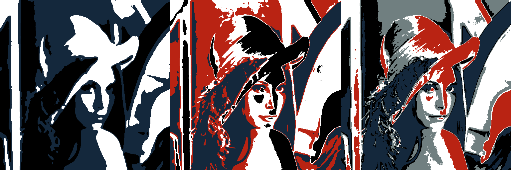

# tritonize


tritonize is a Python 2.7/3.6 script which allows users to convert images to a styled, minimal representation, quickly with NumPy, even on large 12MP+ images. These images use sigmoid thresholding to split the image into 3 (or more) regions of distinct colors, and apply user-defined colors to the image instead: this results in a style similar to that of the famous [Barack Obama "Hope" poster](https://en.wikipedia.org/wiki/Barack_Obama_%22Hope%22_poster).

The script will generate an image and store them in a `tritonize` folder for each possible permutation of the given colors: for 3 colors, that is 6 images; for 4 colors, 24 images; for 5 colors, 120 images.

## Usage

The `tritonize` script is used from the command line:

```shell
python tritonize.py -i Lenna.png -c "#1a1a1a" "#FFFFFF" "#2c3e50" -b 10
```

* the `-i/--image` required parameter specifies the image file.
* the `-c/--color` required parameter specified the color, followed by quote-wrapped hexidecimal color representations
* the `-b/--blur` optional parameter controls the blur strength per megapixel (default: 4)

## Requirements
numpy, scipy, PIL/Pillow

## Maintainer
Max Woolf ([@minimaxir](http://minimaxir.com))

## License
MIT